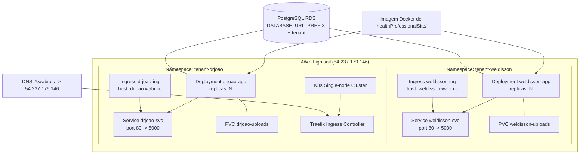

### Arquitetura: Multi-tenant com k3s + Traefik

```mermaid
graph TD
  subgraph Cloud["AWS Lightsail (54.237.179.146)"]
    K3S[K3s Single-node Cluster]
    TRAEFIK[Traefik Ingress Controller]
    K3S --> TRAEFIK

    subgraph Tenant_weldisson["Namespace: tenant-weldisson"]
      D1[Deployment weldisson-app\nreplicas: N]
      S1[Service weldisson-svc\nport 80 -> 5000]
      I1[Ingress weldisson-ing\nhost: weldisson.wabr.cc]
      PVC1[PVC weldisson-uploads]
      D1 --> S1
      I1 --> S1
      D1 --- PVC1
    end

    subgraph Tenant_drjoao["Namespace: tenant-drjoao"]
      D2[Deployment drjoao-app\nreplicas: N]
      S2[Service drjoao-svc\nport 80 -> 5000]
      I2[Ingress drjoao-ing\nhost: drjoao.wabr.cc]
      PVC2[PVC drjoao-uploads]
      D2 --> S2
      I2 --> S2
      D2 --- PVC2
    end

  end

  DNS["DNS: *.wabr.cc -> 54.237.179.146"] --> TRAEFIK
  IMG["Imagem Docker de healthProfessionalSite/"] --> D1
  IMG --> D2
  DB[(PostgreSQL RDS\nDATABASE_URL_PREFIX + tenant)] --- D1
  DB --- D2
```

